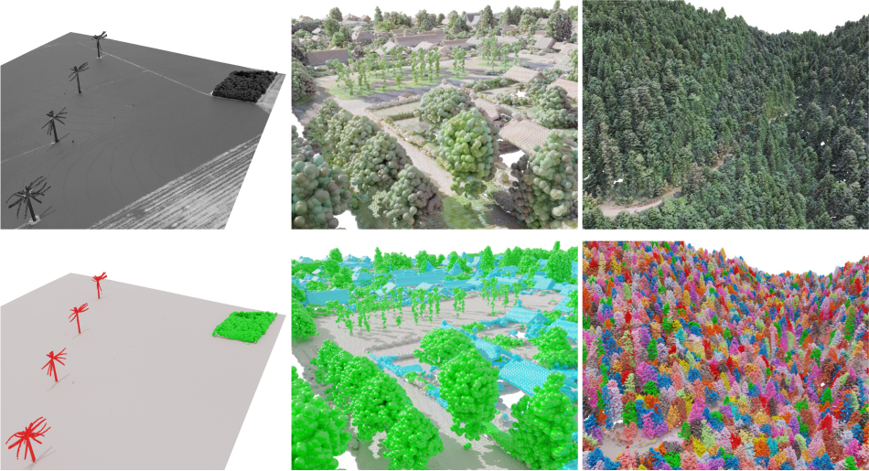

<div align="center">

# Learnable Earth Parser:
# Discovering 3D Prototypes in Aerial Scans

</div>
 
## Description   
Pytorch implementation of the paper "Learnable Earth Parser: Discovering 3D Prototypes in Aerial Scans"



## Installation

### 1. Create and activate conda environment

```
conda env create -f environment.yml
conda activate learnableearthparser
```

Install the fast superquadrics sampler from [https://github.com/paschalidoud/superquadric_parsing](https://github.com/paschalidoud/superquadric_parsing).

**Optional:** some monitoring routines are implemented with `tensorboard`.

**Note:** this implementation uses [`spconv`](https://github.com/traveller59/spconv) for sparse convolutions, [`hydra`](https://hydra.cc) to manage configuration files and command line arguments, and [`pytorch3d`](https://pytorch3d.org/) to compute the Chamfer distance efficiently.

### 2. Download datasets

Go to the website of desired datasets and download them at `/path/to/datasets/` and use `data.data_dir=/path/to/datasets/dataset-name` as a command line argument for python to find your path when using this implementation.

## How to run

### Training the model

To train our best model, launch :
```bash
python main.py +experiment=xp-name
```

The experiments `crop_field`, `forest`, `greenhouse`, `marina`, `power_plant`, `urban` and `windturbine` are stored in config files in `configs/experiments`. Parameters of the ablations to train AtlasNet-v2 and Superquadrics are stored in `configs/ablations` and can be used by appending `+ablations=ablation-name` to the command line.

### Testing the model

To test the model, launch :
```bash
python main.py \
    +experiment=xp-name \
    mode=test \
    model.load_weights="/path/to/trained/weights.ckpt"
```

### Citation   

If you use this method and/or this API in your work, please cite our [paper](https://imagine.enpc.fr/~loiseaur/learnable-earth-parser).